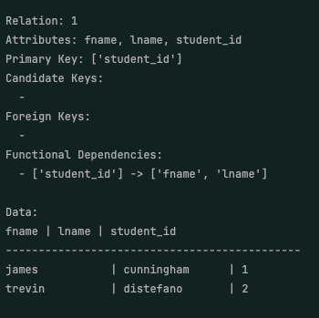

# Final Project Report: RDBMS Normalizer

## Project Overview

This project implements an RDBMS Normalizer, which accepts relations and functional dependencies as input, normalizes the relations through various normal forms up to 5NF, and handles multi-valued dependencies (MVDs) and join dependencies for achieving higher normal forms. The program supports user input through the command line and organizes outputs for each normalization stage directly in the console.

---

## 1. Project Setup and Input Handling

- **Input Method**: Users input data through the command line interface, which can handle relations one at a time.
- **Data Storage Classes**:
  - `Relation`: Stores the relation as lists, allowing for composite values (e.g., composite keys stored as “A|B, C”).
  - `Functional Dependency`: Captures functional dependencies to handle dependencies correctly.
- **Supported Execution Commands**:
  - `python3 main.py` for executing the program with user-selected normal forms.
  - `python3 testing.py` to showcase normalization for all forms on predefined instances.

---

## 2. Normalization Process and Functionality

### Normal Forms: 1NF to BCNF

- **1NF Compliance**: Program ensures 1NF by requiring user confirmation on attributes that may need decomposition into atomic parts, utilizing the primary key of the parent relation.
- **Functional Dependency Validation**:
  - The program verifies that both determinants and dependents in functional dependencies are subsets of the parent’s attributes.
  - Each dependency is stored within the `Relation` class as a list for efficient management.
- **Sequential Normal Form Application**:
  - Each normalization function calls lower-level normalization functions in sequence to ensure compliance with all previous normal forms before applying transformations for the current normal form.

### Handling of 4NF and MVDs

- **4NF Multi-Valued Dependencies**:
  - Primary keys are referenced, and user-inputted data instances for the relation’s tuples are utilized to identify MVDs.
  - The program compares tuple positions for duplicates in the `Relation` data, ensuring correct decomposition into 4NF.
- **Challenges**:
  - Managing and accessing various data types and list structures presented difficulties in ensuring the correct type for each value throughout the normalization process.

### 5NF and Join Dependencies

- **Join Dependency Detection**:
  - Created dedicated functions to detect 5NF anomalies, validate join dependencies, and ensure appropriate decomposition.
- **Methodology**:
  - Detected violations are decomposed into new relations, with relevant functional dependencies corrected to achieve a fully normalized schema.

---

## 3. MVD Extra Credit Implementation

- **Automatic MVD Identification**:
  - The program allows users to input data values into a `data` variable within the `Relation` class.
  - MVD detection operates by examining the primary key’s position within the attribute list, then comparing it against tuple instances to identify duplicate entries, which prompt the user for corrective action.
- **Challenges Overcome**:
  - While storing data was straightforward, accessing specific list positions with appropriate type handling proved challenging.
- **Automatic Detection Approach**:
  - For increased automation, the program can increment primary key values to ensure that MVDs are normalized without user intervention.

---

## 4. Output

- **Output Presentation**:
  - SQL query generation was replaced with structured command-line outputs. Each normalized form and any detected anomalies are clearly displayed in a consistent, organized format.
  - Relations are outputted with details on the anomalies resolved at each normalization stage.

---

## 5. Documentation and Code Structure

- **File Organization**:
  - `classes.py`: Houses `Relation` and `FunctionalDependency` class definitions.
  - `helper_functions.py`: Functions to facilitate interaction with the user and manage class instances.
  - `main.py`: Main executable file that guides the user through normalization form selection, manages functional dependency inputs, and requests tuple data for MVD checks as needed.
  - `normalize_functions.py`: Contains normalization functions for detecting and fixing anomalies in each normal form, along with functions for outputting normalized relations.
- **Code Comments**:
  - Key functions are documented, with logical structure and description for each module.

---

## 6. Project Demonstration Preparation

- **Demonstration Strategy**:
  - The program displays each step of the normalization process in sequence, including decisions made for decomposition and handling of functional dependencies and anomalies.
- **Edge Case Handling**:
  - The program can handle composite keys, non-atomic attributes, and complex MVD cases, prepared to address queries on any edge cases encountered during normalization.

## 7. Assumptions

- Relations normalized to the Second Normal Form or higher are assumed to have functional dependencies inputted.
- Relations normalized to the Fourth Normal Form or higher are assumed to have tuples inputted into the user-created relation.
- For Fourth Normal Form decomposition, the primary key must be a non-composite key to automatically detect multi-valued dependencies.
